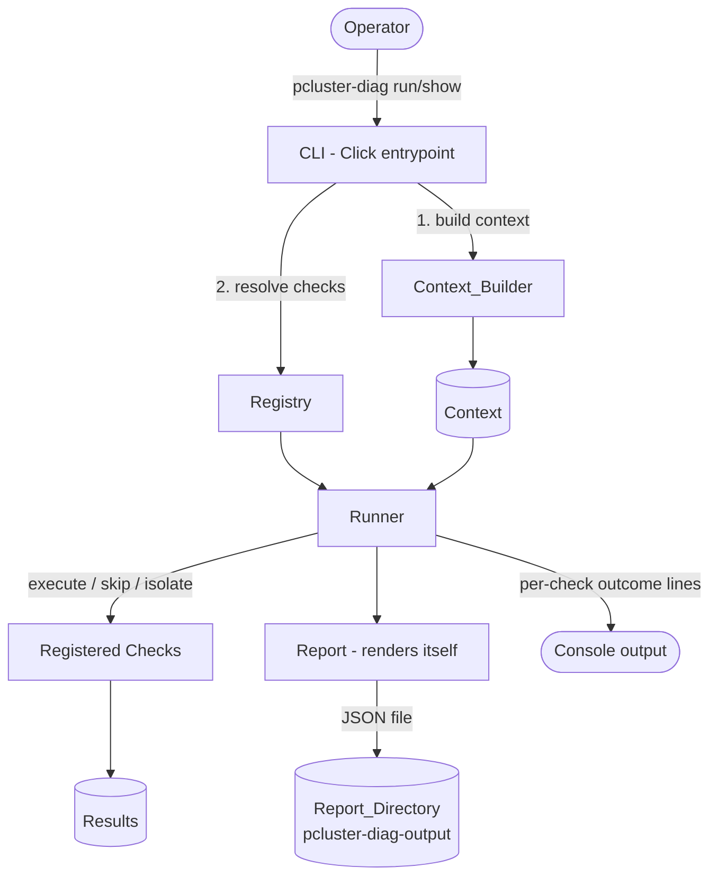
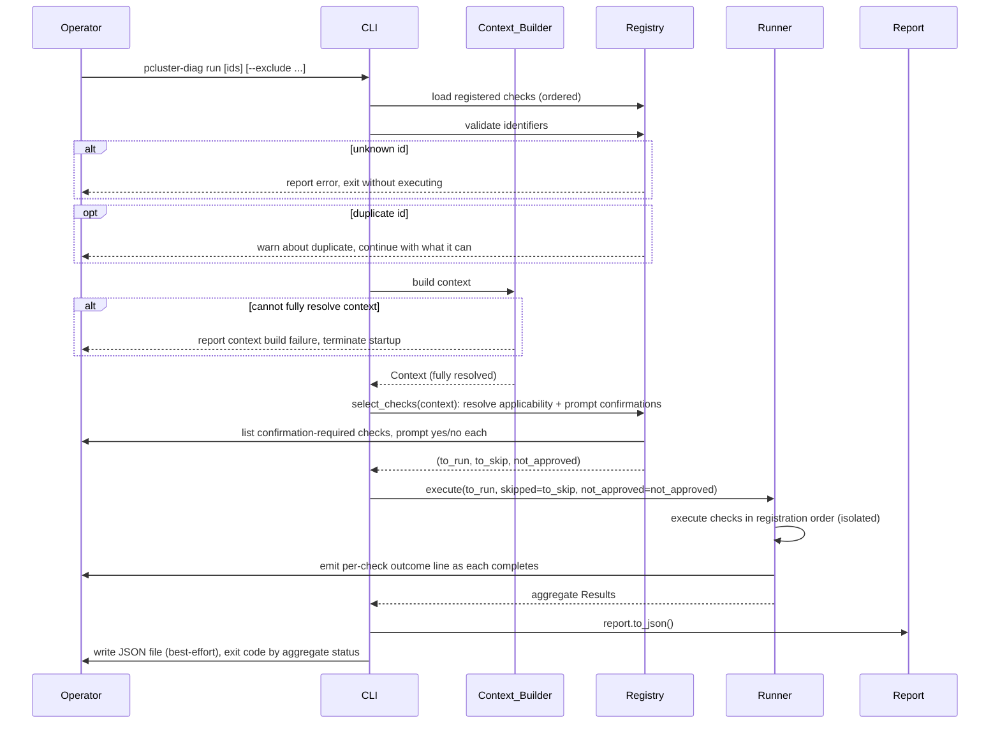

# Design Document

## Overview

The Diagnostics Tool (`pcluster-diag`) is an on-demand, read-only diagnostics utility shipped inside the AWS ParallelCluster AMI. It runs a context-aware set of Checks against a running cluster and produces a structured Report (a JSON file). As the run proceeds, the CLI prints a per-Check outcome line to the console; a richer console table rendering of the full Report is a deferred nice-to-have (see Reporting). It is invoked via the `pcluster-diag` command, which is available on PATH on head, compute, and login nodes without activating any virtual environment.

The design centers on five collaborating concerns:

1. **CLI** — a Click-based entrypoint exposing `run` and `show` subcommands, responsible for privilege validation, argument parsing, user confirmation prompts, and exit codes.
2. **Context construction** — a `Context_Builder` that inspects the node at startup to produce a `Context` describing node type, pcluster version, cluster configuration, `dna.json`, and the tool's own version.
3. **Check framework** — a uniform `Check` interface plus an explicit `Registry` that controls discovery and execution order, with each Check uniquely identified by its class simple name.
4. **Execution** — a `Runner` that executes the selected Checks, isolates failures, and aggregates `Result` objects.
5. **Reporting** — a `Report` model that serializes to JSON (for writing only; no deserialization). A console table rendering equivalent to the JSON Report is a deferred nice-to-have; interim console output is the Runner's per-Check outcome lines.

The tool is packaged as a pip-installable Python project (`pyproject.toml`, Click, Python 3.10+) installed into the existing, pcluster-controlled `cookbook_virtualenv` (a dedicated `pcluster_diag_virtualenv` is a nice-to-have, not provisioned by default). The source is baked into the AMI as a per-node Node_Local_Copy that pip installs from; publishing it to the cluster-wide shared path `/opt/parallelcluster/shared/diagnostics` is a nice-to-have. The tool is updatable from the `aws-parallelcluster-cookbook` repository via pip, and the entire implementation is contained within that cookbook repository.

### Design Goals and Non-Goals

**Goals**
- Read-only, safe-by-default operation requiring no extra IAM permissions and incurring no extra cost unless the operator explicitly confirms.
- Resilient execution: one failing Check never stops the run.
- Low barrier to extension: adding a Check is a small, local change (implement the interface, register it).
- Updatable independent of a ParallelCluster release.
- Must be backward compatible with all plcuster versions under support (pcluster 3.11+)

**Non-Goals** (per requirements)
- build-image diagnostics, automatic remediation, report anonymization, and automated updates in air-gapped environments.

### Research Notes

- **Shared path & virtualenv conventions.** ParallelCluster already places cluster-wide shared assets under `/opt/parallelcluster/shared` (for example `directory_service`, `nvidia-imex`, `cluster-config.yaml`), and provisions Python environments under `/opt/parallelcluster/pyenv/versions/<py>/envs/<name>` (for example `cookbook_virtualenv`, `cfn_bootstrap_virtualenv`). The Diagnostics_Tool installs into the existing pcluster-controlled `cookbook_virtualenv` from a per-node Node_Local_Copy of the source. Publishing the source to a cluster-wide Shared_Source_Path (following the established `/opt/parallelcluster/shared/diagnostics` convention) and provisioning a dedicated `pcluster_diag_virtualenv` (using the same pyenv-based convention) are nice-to-haves, deferred. This keeps cookbook changes idiomatic and confined to the cookbook repository (Req 12, 16).
- **Source-of-truth project location (cookbook repo).** Distinct from the runtime paths above, the source-of-truth project — where `pyproject.toml` and the package live in the Cookbook_Repository (`aws-parallelcluster-cookbook`) — is located at `/Volumes/workplace/aws-parallelcluster-dev/aws-parallelcluster-cookbook/cookbooks/aws-parallelcluster-platform/files/pcluster-diag` (i.e. under `cookbooks/aws-parallelcluster-platform/files/pcluster-diag`). This is what gets baked onto nodes as the per-node Node_Local_Copy (and, as a nice-to-have, published to the Shared_Source_Path `/opt/parallelcluster/shared/diagnostics`); the runtime paths are unchanged.
- **PATH exposure without venv activation.** The established pattern for exposing a venv-installed command on PATH is a thin wrapper/symlink in a PATH directory (for example `/usr/local/bin`) that invokes the venv's interpreter/entrypoint directly. This satisfies Req 1.3 (available on PATH without activating the venv).
- **Click framework.** Click supports nested commands (groups), variadic arguments (for `Check_Identifier` lists), repeatable/typed options (for `--exclude`), and confirmation prompts (`click.confirm`) — a direct fit for the CLI surface in Req 1, 4, 5, 11.

## Architecture



### Component Responsibilities

| Component | Responsibility | Requirements |
|---|---|---|
| CLI | Parse args, orchestrate context build, invoke selection and the Runner, set exit codes | 1, 4, 5, 11 |
| Context_Builder | Inspect node, build a fully-resolved `Context`; abort if any attribute cannot be resolved | 2 |
| Registry | Hold explicitly registered Checks in registration order; warn on duplicates; partition Checks via `select_checks` and prompt confirmations | 3.1–3.2, 6, 11 |
| Runner | Execute selected Checks in isolation and aggregate them into Results | 3, 8, 9 |
| Check (interface) | Provide `description`, `should_run`, `approval_required`, `run` | 6, 7, 9 |
| Result | Carry Status, message, metadata | 7 |
| Report (model) | Aggregate the Context and per-Check Results; own `save` (writes JSON, returns path), `OUTPUT_DIR_NAME`, and the filename template. The `serialization` helpers render JSON; the generic I/O layer writes the file. (A console table rendering is a deferred nice-to-have.) | 10 |
| Packaging/Install | pip project, dedicated venv, shared source + node-local fallback, updates | 1.1, 12, 13, 14, 15, 16, 17 |

### Startup Sequence (`run`)



## Components and Interfaces

### CLI (Click)

```
pcluster-diag
├── run [CHECK_ID ...] [--exclude CHECK_ID ...] [--<check-opt> ...]
└── show
```

- **Help option.** The top-level `pcluster-diag` group and each subcommand (`run`, `show`) expose Click's native help option (`--help`). Click generates this
  automatically from the command/option metadata; the design makes it explicit that every command surface documents its usage, arguments, and options through
  `--help`. Help is a documentation action only — it performs no Context build and no Check execution.
- **Version option.** The top-level `pcluster-diag` group exposes a `--version` option (Click's `version_option`) that prints the tool's installed version (resolved from the package metadata) and exits, performing no Context build and no Check execution.
- **`run`**: resolves the Check selection, builds the Context, runs the Runner, prints per-Check progress to the console as each Check executes (see below), and emits the Report.
- **`show`**: builds the Context, lists the Checks that will run for the current Context with their `Check_Identifier`, `description()`, and whether each requires confirmation (`approval_required(context)`); performs no execution (Req 5).
- **Selection resolution rules**:
  - No identifiers → all Checks where `should_run(context)` is true (Req 3.3, 3.4).
  - Explicit identifiers → exactly those Checks, run even if `should_run(context)` is false (Req 4.1, 4.3, 9.1).
  - `--exclude` → applicable Checks minus excluded ones (Req 4.2).
  - Unknown identifier → report and exit without executing (Req 4.4).
- **Confirmation gating**: the `Registry.select_checks(context)` step lists all selected Checks requiring confirmation (approval-required and Cost_Incurring_Check) and prompts yes/no for each; execution begins only after all prompts are answered (Req 6.10, 11.3). A declined prompt yields a SKIPPED Result (Req 6.4, 11.4).
- **Execution progress and per-Check outcome**: as the Runner executes the selected Checks, the CLI emits a console line for each Check as it runs and, once that Check completes, a line reporting its outcome (the Result `Status`, e.g. `PASSED`, `FAILURE`, `ERROR`, `SKIPPED`). This gives the operator a live, check-by-check indication of progress and result, so even a long-running run makes clear which Check is in flight and how each one turned out. These lines are console-only and do not alter the JSON Report.
- **Console report rendering (deferred nice-to-have)**: rendering the full Report to the console as a table (one row per executed Check) is a deferred enhancement, tracked as a low-priority task. Until it lands, the per-Check outcome lines above are the run's console output and the JSON file is the complete Report.

### Context_Builder and Context

```python
class Context:
    pcluster_diag_version: str          # reports the package version; 1.0.0 for the initial release
    node_type: NodeType                 # HEAD | COMPUTE | LOGIN
    pcluster_version: Optional[str]
    cluster_config: Optional[dict]      # deployed cluster configuration
    dna_json: Optional[dict]

class ContextBuilder:
    def build(self) -> Context: ...
```

- Resolves node type, pcluster version, cluster config + `dna.json`, and the tool's own version (Req 2.1–2.4). `pcluster_diag_version` reports the installed package version (from `pyproject.toml`), which is `1.0.0` for the initial release.
- Node type is classified idiomatically: each `NodeType` member's value is the exact `cluster.node_type` token from `dna.json`, so the builder resolves it directly with `NodeType(token)` (no lookup table); an unknown token raises `ValueError`, which the all-or-nothing build surfaces as a `node_type` failure.
- Context construction is all-or-nothing: every attribute must be resolved successfully. If any attribute cannot be determined, `build()` raises and the CLI terminates startup reporting the failure; a partially-resolved Context is never produced (Req 2.5, 2.6).

### Check interface and Registry

```python
class Check(ABC):
    def description(self) -> str: ...
    def should_run(self, context: Context) -> bool: ...
    def approval_required(self, context: Context) -> bool:
        return False
    def run(self, context: Context) -> "Result": ...

    @property
    def identifier(self) -> str:
        return type(self).__name__        # class simple name (Req 6.6)
```

```python
class Registry:
    def register(self, check: Check) -> None: ...   # explicit, order-preserving
    def registered_checks(self) -> list[Check]: ...  # registration order (Req 3.5)
    def get(self, identifier: str) -> Optional[Check]: ...
    def select_checks(self, context: Context) -> tuple[list[Check], list[Check], list[Check]]: ...
```

- Only explicitly registered Checks are executed; unregistered `Check` subclasses are silently ignored (Req 6.7, 6.8).
- Registration preserves order so the developer controls execution order (Req 3.2, 3.5).
- Duplicate identifiers (same class simple name) are detected at registration/validation time; the CLI emits a warning naming the duplicated `Check_Identifier` and continues, executing the Checks it can. Selection and `get(identifier)` resolve a duplicated identifier to the first Check registered under that name (Req 6.9).
- `select_checks(context)` partitions the registered Checks (in registration order) into a `(to_run, to_skip, not_approved)` triple and owns confirmation prompting: applicable, confirmation-required Checks are listed and prompted yes/no here, before the Runner is invoked, so a declined Check lands in `not_approved` (Req 6.4, 6.10, 11.3, 11.4) and a non-applicable Check lands in `to_skip` (Req 3.4, 3.6).

### Runner

```python
class Runner:
    def execute(self, context: Context, check_to_run: list[Check],
                check_to_skip: list[Check] = (),
                check_not_approved: list[Check] = ()) -> list[Result]: ...
```

- The Runner exposes a single public method, `execute`. Selection and confirmation prompting (against the registry) are performed by `Registry.select_checks` before invoking `execute`; the Runner receives the resolved `checks` to run plus the `skipped` and `not_approved` partitions.
- Executes selected Checks in registration order (Req 3.5).
- Each Check runs in isolation: an unhandled exception becomes an ERROR Result (with stack trace) and execution continues (Req 7.5, 8.1). A FAILURE Result also does not stop the run (Req 8.2).
- Records a SKIPPED Result for each non-applicable Check in `skipped` (Req 3.6) and a SKIPPED "Skipped by the user" Result for each declined Check in `not_approved` (Req 6.4, 11.4).
- As each Check completes, the Runner emits a console line reporting that Check's outcome (its Result `Status`); see the CLI section.
- For an explicitly-run Check whose `should_run(context)` is false, the Runner produces a FAILURE Result identifying the unmet preconditions (Req 9.1, 9.2).

### Report rendering

```python
@dataclass
class Report:
    context: Context
    results: list[Result]
```

The Report is a plain data aggregate (the captured Context plus the per-Check Results). Serialization lives in a small, generic `serialization` helper module that operates on any dataclass:
- `to_dict(report)` / `to_json(report)` — return the dict / JSON representation of the Report for writing only; the Report is never deserialized (see Property 18).

A console table rendering of the Report (`to_table`) is a **deferred nice-to-have** (tracked as a low-priority task), not part of the current implementation. When added, it must keep the `serialization` module generic (domain-agnostic), so the Result-specific row building belongs on the Report (or a dedicated rendering helper), not in `serialization`.

The report's output directory name, filename template, and target path are **Report responsibilities** (see Data Models): the Report owns `OUTPUT_DIR_NAME` (`pcluster-diag-output`), the filename template (`pcluster-diag-report-<timestamp>.json`), and a `save(base_dir)` method that writes the JSON and returns the written path, with the filename embedding a `YYYY-MM-DDThh-mm-ss` timestamp generated when `save` is called (no longer from the Context).

Actually writing the JSON to a file is handled by a small, generic **I/O utility layer** (common helpers reused across the CLI), keeping side effects out of the serialization helpers. This layer has no report/dir/filename/timestamp knowledge:
- `write_text_file(path, text)` — creates the parent directories of `path` if absent and writes `text` to it. It does **not** suppress exceptions: any write error propagates to the caller.
- Console output (the per-Check outcome lines) is emitted directly via `click.echo` at the call sites, so there is no separate console helper.

Behavior provided by these collaborators:
- The JSON file is written by the Report's `save(base_dir)` (the `pcluster-diag-output` directory under the current working directory), with parent directories created by `write_text_file` (Req 10.1, 10.4).
- The filename includes a human-readable timestamp `YYYY-MM-DDThh-mm-ss` generated when the report is written, via the Report's filename template (Req 10.7).
- Console output of the run is the Runner's per-Check outcome lines (one `Check_Identifier: Status` line per Check). The full console table that is equivalent to the JSON Report (Req 10.2) is the deferred nice-to-have described above; the JSON Report remains the complete, structured output (Req 10.3) and is unchanged. When the table lands it will present, per executed Check: check name (`Check_Identifier`), description, outcome (`Status`), message, and data (`metadata`).
- JSON file write is best-effort, enforced by the **`run` command (the caller)**, not by the writer: `write_text_file` surfaces any write error, and the `run` command wraps the write so that, on failure, the run still completes successfully (Req 10.6).

## Data Models

### Status

```python
class Status(Enum):
    PASSED = "PASSED"
    ERROR = "ERROR"        # check raised / could not complete
    FAILURE = "FAILURE"    # check completed; condition not satisfied
    SKIPPED = "SKIPPED"    # not applicable, declined, or user-skipped
```

### Result

```python
@dataclass
class Result:
    check_id: str                  # Check_Identifier (class simple name)
    status: Status
    description: str = ""          # the Check's human-readable description, stamped at creation time
    message: Optional[str] = None  # reason / recovery suggestion / stack trace
    metadata: dict = field(default_factory=dict)  # underlying data
```

Semantics by Status:
- **PASSED**: condition satisfied.
- **FAILURE**: condition not satisfied; message states the reason and any recovery suggestion where one can be generated (Req 7.2, 7.4); a message may be absent if none can be generated (Req 7.3); for force-run non-applicable Checks the message identifies unmet preconditions (Req 9.2).
- **ERROR**: an exception occurred; message contains the stack trace (Req 7.5).
- **SKIPPED**: not applicable (Req 3.6), declined confirmation/cost prompt (Req 6.4, 11.4), or user-skipped with message "Skipped by the user" (Req 6.4).
- `description` carries the Check's human-readable description, captured when the Result is created (by the Runner) so the Report carries it in the serialized output (and the deferred console table) without a registry lookup.
- `metadata` carries any underlying data referenced by the Result (Req 7.6).

### Report

```python
@dataclass
class Report:
    context: Context               # the Context exactly as captured by the tool
    results: list[Result]
```

- The Report attaches the `Context` as captured by the tool at startup, so the JSON carries the full diagnostic context (node type, pcluster version, cluster config, `dna.json`, and the tool's own version) alongside the results (Req 2, 10.3).
- Each executed Check contributes one entry containing `check_id`, `status`, `description`, `message`, and `metadata` (Req 10.3).
- The Report (including its embedded `Context`) serializes to JSON for writing only; it is never deserialized back into a Report. Serialization helpers expose `to_dict`/`to_json` (serialize-only, in the generic `serialization` module), and there is no `from_json`/`from_dict` (and the embedded `Context` likewise has no `from_dict`). A console table rendering is a deferred nice-to-have and is not part of `serialization`.
- The Report owns the output layout: a class-level `OUTPUT_DIR_NAME` (`pcluster-diag-output`), the filename template (`pcluster-diag-report-<timestamp>.json`), and a `save(base_dir)` method that writes the JSON and returns the written path. `save(base_dir)` generates the `YYYY-MM-DDThh-mm-ss` filename timestamp at call time.

### Report file layout

```
./pcluster-diag-output/
└── pcluster-diag-report-2025-01-31T14-22-05.json
```

The timestamp embedded in the filename (`YYYY-MM-DDThh-mm-ss`) is generated when the report is written, not from a separate Report field.

### Packaging & Deployment Model

- **Project**: `pyproject.toml`-based, Click dependency, Python 3.10+, console-script entrypoint `pcluster-diag` (Req 1.1). The project version declared in `pyproject.toml` is `1.0.0` for the initial release.
- **Virtualenv**: installed into the existing pcluster-controlled `cookbook_virtualenv` (a Pcluster_Virtualenv) via pip (Req 12.1). The install is offline — `pip install --no-build-isolation --no-index` — so it never reaches PyPI: the runtime deps (`click`, `PyYAML`) and the build backend (`setuptools`, `wheel`) are already present in `cookbook_virtualenv` (Req 12.3). A dedicated `pcluster_diag_virtualenv`, provisioned with the same pyenv-based method, Python version, and package versions as other Pcluster_Virtualenv environments, is a nice-to-have (Req 12.5) and is not provisioned by default.
- **PATH**: a wrapper in a PATH directory invokes the venv entrypoint so the command works without venv activation (Req 1.3).
- **Source locations**: the source-of-truth project lives in the Cookbook_Repository at `cookbooks/aws-parallelcluster-platform/files/pcluster-diag` (absolute: `/Volumes/workplace/aws-parallelcluster-dev/aws-parallelcluster-cookbook/cookbooks/aws-parallelcluster-platform/files/pcluster-diag`), where `pyproject.toml` and the package reside. From there it is baked onto nodes as a per-node Node_Local_Copy that pip installs from (Req 12.2). Publishing the source to the cluster-wide `/opt/parallelcluster/shared/diagnostics` (Req 12.4) with a node-local fallback (Req 14.2) is a nice-to-have.
- **Updates**: `pip install` pointing at the cookbook repo subfolder installs the specified version into the venv (Req 13.1); a failed update reports the failure (best-effort) and leaves the previous version in place (Req 13.2); a README documents update steps (Req 13.3).
- **Containment**: all changes live in the `aws-parallelcluster-cookbook` repository (Req 16), with a CHANGELOG entry (Req 17).

## Correctness Properties

*A property is a characteristic or behavior that should hold true across all valid executions of a system — essentially, a formal statement about what the system should do. Properties serve as the bridge between human-readable specifications and machine-verifiable correctness guarantees.*

The properties below are derived from the acceptance criteria identified as property-testable during prework. Redundant criteria were consolidated (for example, the selection-partition, isolation, declined-skip, and confirmation-gating families) so each property provides unique validation value. Infrastructure, packaging, documentation, and version-compatibility criteria (Requirements 1.1–1.3, 1.4, 11.1–11.2, 12, 13.1, 13.3, 14, 15, 16, 17) are covered by smoke and integration tests in the Testing Strategy rather than by properties. Properties 3 and 10 were removed (Property 10 covered per-Check `kwargs` forwarding, which was dropped), leaving gaps in the numbering.

### Property 2: Context build is all-or-nothing

*For any* subset of Context attributes designated as undeterminable, `ContextBuilder.build()` SHALL raise (terminating startup, with no Check executed) when that subset is non-empty, and SHALL return a fully-resolved Context only when every required attribute is determined. No partially-resolved Context is ever produced.

**Validates: Requirements 2.5**

### Property 4: Registry fidelity and identification

*For any* sequence of explicitly registered Checks (mixed with unregistered Check subclasses), the discovered Checks SHALL be exactly the registered ones, each identified by its class simple name, and no unregistered Check SHALL appear or produce output.

**Validates: Requirements 3.1, 6.6, 6.7, 6.8**

### Property 5: Execution follows registration order

*For any* registry and any selection of Checks, the Checks SHALL execute in an order consistent with their registration order (the executed sequence is the registration order filtered to the selection).

**Validates: Requirements 3.2, 3.5**

### Property 6: Default selection partitions Checks by applicability

*For any* Context and registry, a `run` invocation without identifiers SHALL execute exactly the Checks whose `should_run(context)` is true and SHALL record a SKIPPED Result for every Check whose `should_run(context)` is false.

**Validates: Requirements 3.3, 3.4, 3.6**

### Property 7: Explicit identifiers select exactly those Checks, even when not applicable

*For any* subset of registered Check_Identifiers passed as `run` arguments, the Runner SHALL execute exactly those Checks (and no others), including Checks whose `should_run(context)` returns false.

**Validates: Requirements 4.1, 4.3**

### Property 8: Exclude removes only the named Checks from the applicable set

*For any* Context and any set of excluded Check_Identifiers, the executed set SHALL equal the applicable Checks minus the excluded Checks.

**Validates: Requirements 4.2**

### Property 9: Unknown identifier aborts without execution

*For any* include or exclude identifier set containing at least one identifier that matches no registered Check, the CLI SHALL report the unrecognized identifier and SHALL exit without executing any Check.

**Validates: Requirements 4.4**

### Property 11: `show` lists exactly the default selection with required fields and no execution

*For any* Context and registry, the `show` subcommand SHALL list exactly the Checks that a default `run` would execute, SHALL include each listed Check's identifier, `description()` text, and its `approval_required(context)` flag, and SHALL execute no Check.

**Validates: Requirements 5.1, 5.2, 5.3, 5.4**

### Property 12: Duplicate identifiers warn but do not abort execution

*For any* registry containing two Checks with the same class simple name, the CLI SHALL emit a warning naming the duplicated Check_Identifier and SHALL continue, executing the Checks it can; identifier resolution (selection and `get(identifier)`) SHALL resolve the duplicated identifier to the first Check registered under that name.

**Validates: Requirements 6.9**

### Property 13: Confirmation-required Checks are listed and prompted before any execution

*For any* selection containing Checks that require confirmation (approval-required or cost-incurring), the CLI SHALL list and prompt yes/no for every such Check before any Check's `run` is invoked.

**Validates: Requirements 6.10, 11.3**

### Property 14: Declined confirmation yields SKIPPED

*For any* Check requiring confirmation that the user declines, the recorded Result SHALL have Status SKIPPED (with message "Skipped by the user" for the approval-required decline case), regardless of any other factor.

**Validates: Requirements 6.4, 11.4**

### Property 15: Every completed Check yields a valid Status

*For any* Check execution, the resulting Result's Status SHALL be one of PASSED, ERROR, FAILURE, or SKIPPED.

**Validates: Requirements 7.1**

### Property 16: Execution isolation across the run

*For any* sequence of selected Checks where an arbitrary subset raise unhandled exceptions and another arbitrary subset return FAILURE, every Check in the sequence SHALL still produce a Result, and each raising Check SHALL produce an ERROR Result whose message contains the exception stack trace.

**Validates: Requirements 7.5, 8.1, 8.2**

### Property 17: Forcing a non-applicable Check yields FAILURE identifying unmet preconditions

*For any* Check whose `should_run(context)` is false, executing it explicitly SHALL return a FAILURE Result whose message identifies the preconditions that are not met, regardless of whether individual preconditions happen to be satisfied.

**Validates: Requirements 9.1, 9.2**

### Property 18: Report serialization includes each Check's content

*For any* Report, serializing it to JSON SHALL produce, for each executed Check, an entry containing the Check_Identifier, Status, message, and metadata.

**Validates: Requirements 10.3**

### Property 19: Console output is equivalent to the JSON Report (DEFERRED — nice-to-have)

**Deferred:** This property covers the console table rendering, which is a deferred nice-to-have (see the
low-priority task in the implementation plan). It is not implemented or tested yet. When the table lands,
the property is: *for any* Report, the console table SHALL contain one row per executed Check, where each
row presents that Check's check name (Check_Identifier), description, outcome (Status), message, and data
(metadata) consistent with the corresponding entry in the JSON Report.

**Validates: Requirements 10.2**

### Property 20: JSON write is best-effort

*For any* set of Results, the generic file-writing utility (`write_text_file`) SHALL surface (not suppress) any write error, and when the write fails the `run` command SHALL still complete successfully and emit console output (no crash and a success exit). Best-effort behavior is enforced by the caller (`run`), not by the writer.

**Validates: Requirements 10.6**

### Property 21: Report filename carries a well-formed timestamp

*For any* Report, the filename produced by `Report.save` SHALL contain a timestamp formatted as `YYYY-MM-DDThh-mm-ss` (generated when the report is written).

**Validates: Requirements 10.7**

## Error Handling

The tool's central error-handling principle is **fail-safe partial completeness**: with the sole exception of pre-execution guard failures (unknown identifier, Context build failure — whether an undeterminable required attribute or a system error), no single failure aborts the run. A duplicate Check_Identifier is *not* such a guard failure: it produces a warning and the run proceeds with what it can execute.

| Condition | Handling | Requirement |
|---|---|---|
| Context attribute undeterminable | Terminate startup; report which required attribute could not be determined; non-zero exit (Context build is all-or-nothing) | 2.5 |
| Context build system error | Terminate startup; report context build failure; non-zero exit | 2.6 |
| Unknown Check_Identifier | Report identifier; exit without executing | 4.4 |
| Duplicate Check_Identifier | Warn naming the duplicate; continue, executing what it can (identifier resolves to first registered) | 6.9 |
| Check raises unhandled exception | Record ERROR Result with stack trace in message; continue | 7.5, 8.1 |
| Check returns FAILURE | Record FAILURE (with reason/recovery where available); continue | 7.2, 7.4, 8.2 |
| Skip-recording failure | Continue executing remaining Checks | 3.7 |
| Declined confirmation / cost prompt | Record SKIPPED ("Skipped by the user" for approval decline); continue | 6.4, 11.4 |
| Force-run non-applicable Check | FAILURE identifying unmet preconditions | 9.1, 9.2 |
| JSON write failure | Writer (`write_text_file`) surfaces the error; the `run` command applies best-effort wrapping: run completes with console output only; success exit | 10.6 |
| Update fetch failure | Always attempt to report failure (even if reporting itself may fail); leave prior version installed | 13.2 |
| Unhandled supported-version incompatibility | Fail immediately with a clear, specific error message | 15.2 |
| Shared source unavailable (nice-to-have) | Run from the node-local install in the cookbook_virtualenv; Node_Local_Copy fallback | 14.1, 14.2 |

**Exit codes.** `0` for a completed run (including runs with FAILURE/ERROR Results, duplicate-identifier warnings, and best-effort write failures, so automation can rely on completion); non-zero for pre-execution guard failures (unknown identifier, Context build failure — undeterminable required attribute or system error). The aggregate Result statuses are conveyed in the Report rather than overloaded onto the process exit code, keeping "the tool ran" distinct from "a check found a problem."

## Testing Strategy

The tool uses a dual approach: **property-based tests** for universal logic and **example/integration/smoke tests** for concrete behaviors, infrastructure, and packaging. PBT is appropriate here because the core logic (selection, isolation, serialization, context mapping) consists of pure or easily-mockable functions with large input spaces. PBT is deliberately **not** used for installation, AMI baking, virtualenv provisioning, IAM/cost guarantees, version-compatibility matrices, or documentation artifacts — these are validated by integration and smoke tests.

### Property-Based Tests

- **Library**: Use [Hypothesis](https://hypothesis.readthedocs.io/) (Python). Do not implement property-based testing from scratch.
- **Iterations**: configure each property test to run a minimum of 100 examples.
- **Tagging**: each property test is tagged with a comment in the format
  `# Feature: diagnostics-tool, Property {number}: {property_text}`.
- **Coverage**: implement each of Properties 1–21 with a single property-based test.
- **Generators**:
  - *Checks*: a generator producing synthetic `Check` instances with controllable `should_run`, `approval_required`, and `run` outcomes (including raising checks and arbitrary `Result`s).
  - *Registries*: sequences of synthetic Checks with controllable identifiers (including duplicates and unregistered subclasses).
  - *Contexts*: generated node types (every Context is fully resolved; there is no undetermined-attribute concept).
  - *Reports/Results*: generated Status, message (including `None`), and arbitrary JSON-serializable metadata for serialization-content testing.
  - *Argument sets*: include/exclude identifier subsets.
- AWS/system interactions are mocked so property tests remain fast and side-effect free.

### Example / Unit Tests

Used for concrete behaviors and conditional content not suited to universal quantification:
- Context startup wiring and field population from fixtures (Req 2.1, 2.3, 2.4).
- Node-type classification mapping to {head, compute, login} (Req 2.2).
- Check interface shape and type contracts (Req 6.1, 6.2, 6.3, 6.5).
- FAILURE/ERROR message content for representative checks: reason present, recovery suggestion present, message-absent edge case, metadata population (Req 7.2, 7.3, 7.4, 7.6).
- Edge cases: skip-recording failure isolation (Req 3.7), Context build termination on an undeterminable required attribute and on a system error (Req 2.5, 2.6), Report_Directory creation when absent (Req 10.4), update fetch failure leaving prior version (Req 13.2), version-incompatibility immediate failure (Req 15.2).
- CLI help: `pcluster-diag --help`, `pcluster-diag run --help`, and `pcluster-diag show --help` each exit successfully and emit usage text, performing no
  Context build or Check execution (Req 5 surface; Click-native behavior).
- CLI version: `pcluster-diag --version` prints the installed version and exits successfully, performing no Context build or Check execution.
- Console progress and per-Check outcome: a `run` over a set of Checks prints each executing Check's `Check_Identifier` to the console before/as it runs, and prints a per-Check outcome line reporting that Check's Result `Status` once it completes (mock Checks; assert each Check's name and its resulting outcome appear in the emitted console output, and that these console-only lines do not alter the JSON Report).
- Console table rendering (DEFERRED — nice-to-have): when implemented, `to_table` must produce a table whose rows correspond one-to-one with executed Checks and whose columns include check name, description, outcome (Status), message, and data (metadata), sourced solely from each Result (the description is the Result's own `description` field) (Req 10.2, 10.3). Not implemented or tested in the current scope.
- I/O utility layer: `write_text_file` creates the parent directories of the target path if absent and writes the text, propagating (not suppressing) any write error; console output is emitted directly via `click.echo`. The `run` command wraps the write to apply best-effort behavior (run completes) on failure. The Report owns `save`/`OUTPUT_DIR_NAME`/filename template; the generic `serialization` helpers `to_json`/`to_dict` perform no I/O (Req 10.1, 10.4, 10.6).

### Integration Tests (1–3 examples each)

- Invocation on head, compute, and login nodes (Req 1.2).
- Default run uses only node IAM permissions and incurs no extra cost; no Cost_Incurring_Check in the default execution set (Req 11.1, 11.2).
- (Nice-to-have) WHERE a dedicated Diagnostics_Virtualenv is provisioned, it matches other Pcluster_Virtualenv environments in method, Python, and package versions (Req 12.5).
- pip install from the cookbook subfolder installs the specified version into the venv (Req 13.1).
- (Nice-to-have) Fallback to Node_Local_Copy when a provisioned Shared_Source_Path is unavailable (Req 14.2).
- Operation against representative Support_Policy versions (Req 15.1).

### Smoke / Configuration Tests (single execution)

- `pcluster-diag` resolvable on PATH without venv activation (Req 1.1, 1.3).
- Project builds and entrypoint imports under Python 3.10+ (Req 1.1).
- Read-only guarantee: a default run issues no mutating filesystem/AWS calls (Req 1.6).
- Node_Local_Copy source present on the node; package importable from the `cookbook_virtualenv`; tool baked into AMIs; install from local sources is offline (no PyPI access) (Req 12.1, 12.2, 12.3).
- README with update instructions exists (Req 13.3).
- All changes confined to the cookbook repository (Req 16.1, 16.2).
- CHANGELOG entry present (Req 17.1).
